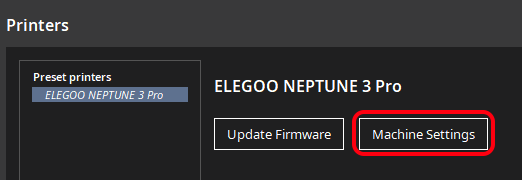

# Elegoo Neptune Thumbnails Plugin For Cura

## Support This Project

If you like this plugin, consider supporting me :)

## General Info

Cura 5.X plugin for adding G-code thumbnail images for Elegoo Neptune printers (tested for Elegoo Neptune 3 Pro). I have
not tested every printer, but it seems like based on feedback at least the following models are supported for other
models, see [FAQ](#faq)):

- Elegoo Neptune 2
- Elegoo Neptune 2S
- Elegoo Neptune 3 Pro
- Elegoo Neptune 3 Plus
- Elegoo Neptune 3 Max

Additional Features:

- The estimated print time can be added to thumbnail
- Add estimated filament usage in meters to thumbnail
- Add estimated filament usage in grams (default 1.75 mm pla) to thumbnail
- Add layer height to thumbnail
- Add total object height to thumbnail

> If you have some idea on how to improve the plugin, feel free to create an issue for that

## Installation

> **Note:** Make sure, that your printer was added to Cura using the official definition for your Neptune printer as a
> base.
> If you for example used an Ender 3 definition as a base and modified it, it won't work because the plugin cannot
> identify the printer model

1) Download:
    - Option A (newest version):
      From [GitHub](https://github.com/Molodos/ElegooNeptuneThumbnails/releases/latest/download/ElegooNeptuneThumbnails.curapackage)
      and drag the `.curapackage` file into the Cura window (like onto the build
      plate) 
    - Option B (version could be outdated because review of Ultimaker takes some time): Install
      from [Cura marketplace](https://marketplace.ultimaker.com/app/cura/plugins/molodos/ElegooNeptune3Thumbnails)
2) Restart Cura
3) Configure the plugin as shown in [Usage](#usage)
4) If it isn't working, check the [FAQ](#faq)
5) (Note: This plugin collects anonymous [usage statistics](#usage-statistics) for improvements if not disabled)

## Usage

To make the plugin work, you must at least add the option `;includeThumbnail` to your printers start G-code

### Possible Options

> **Note:** A maximum of 4 options more than `;includeThumbnail` and `;disableStatistics` is supported. \
> The order in which you specify your options in the start G-code will also be the display
> order (`top-left` > `top-right` > `bottom-left` > `bottom-right`)

| Option                           | Description                                                                                                                        |
|----------------------------------|------------------------------------------------------------------------------------------------------------------------------------|
| `;disableStatistics`             | Disables the collection of anonymous [usage statistics](#usage-statistics)                                                         |
| `;includeThumbnail`              | Includes a thumbnail of the object to the gcode                                                                                    |
| `;includeTimeEstimate`           | Includes the estimated print time in the thumbnail (needs `;includeThumbnail` to be active)                                        |
| `;includeFilamentMetersEstimate` | Includes the estimated filament usage in meters in the thumbnail (needs `;includeThumbnail` to be active)                          |
| `;includeFilamentGramsEstimate`  | Includes the estimated filament usage in grams (for 1.75mm diameter PLA) in the thumbnail (needs `;includeThumbnail` to be active) |
| `;includeLayerHeight`            | Includes the layer height in the thumbnail (needs `;includeThumbnail` to be active)                                                |
| `;includeModelHeight`            | Includes the model height in the thumbnail (needs `;includeThumbnail` to be active)                                                |
| `;includeCostEstimate`           | Includes the estimated print cost in €                                                                                             |

### Adding An Option

1) Open printer selection menu and choose `Manage printers` \
   
2) Choose your Elegoo Neptune printer and then `Machine Settings` \
   
3) At the top of `Start G-code` add your preferred options \
   

## FAQ

### Does my printer support this plugin?

I am pretty sure, that the plugin cannot break anything as it just generates an encoded image in the G-code, that a
printer will only interpret if it can. So I guess just try it out. To be sure, you should look at your printer for the
start of the print and be ready to cancel the print if it seems to behave weird.

### Thumbnails are not generated, what to do?

1) Make sure, that the plugin is installed correctly. Click "Marketplace" on the top right and then the settings gear on
   the top right. The plugin should be displayed under "Installed Plugins"
2) Make sure, that your printer was added to Cura using the official definition for your Neptune printer as a base. If
   you for example used an Ender 3 definition as a base and modified it, it won't work because the plugin cannot
   identify the printer model

### Why does my Neptune 3 not display thumbnails?

For now, the Neptune 3 model is disabled as it also is disabled in the official Elegoo Cura. I have heard, that support
for thumbnails might be added to the printer firmware, so I might be adding thumbnails for that printer in the
future, if this can be confirmed somehow.

### Why do thumbnails not change when printing another G-code file?

There seems to be a bug in older printer firmware versions which causes the thumbnail to not update if you start a print
right after the last one ended. Restarting the printer in between prints seems to fix that. If this is the case for you,
check your printer for firmware updates, which might fix the bug.

### Will there be PrusaSlicer support at some point?

Currently, I am not planning to release a PrusaSlicer version of the plugin. Maybe in further distance, there could be a
chance, but for now I do not have enough time to do that. I will keep this in mind as there were several requests, but
do not expect any news too soon.

## Development Guide

1) Install requirements `pip install -r requirements.txt`
2) Add `cura` folder from https://github.com/Ultimaker/Cura to base directory (needed as lib)
3) Add `UM` folder from https://github.com/Ultimaker/Uranium to base directory (needed as lib)
4) Develop
5) Create package `python -m package_plugin` (package will be
   under `package_plugin/ElegooNeptuneThumbnails.curapackage`)
6) Use the `text/test.py` script for testing the formatting of image texts

> Note: For some reason, QPainter will not accept all pngs. Usually, re-saving pngs with paint will fix problems

## Usage Statistics

The plugin will collect some anonymous usage statistics in order to make improvements easier. You can opt out of usage
statistics by adding the option `;disableStatistics` at any time.

Usage statistics are only related to an anonymous statistics id that is generated randomly when you install the plugin.
No personal data is being collected. The statistics data, that is collected, is limited to the following:

- Name of this plugin
- Version of this plugin
- The anonymous statistics id
- The printer type (e.g. "Elegoo Neptune 3 Pro")
- The options you are using (e.g. `;includeLayerHeight`)

> **Note:** This list might change at some time, so keep an eye on it if you update the plugin. Be aware, that personal
> data
> will never be added to this list.

## Contribution

This repository is based on [sigathi/ElegooN3Thumbnail](https://github.com/sigathi/ElegooN3Thumbnail) and therefore
released under the **AGPL v3** license.
