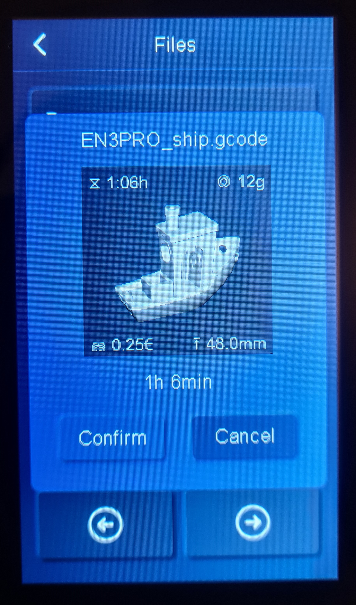
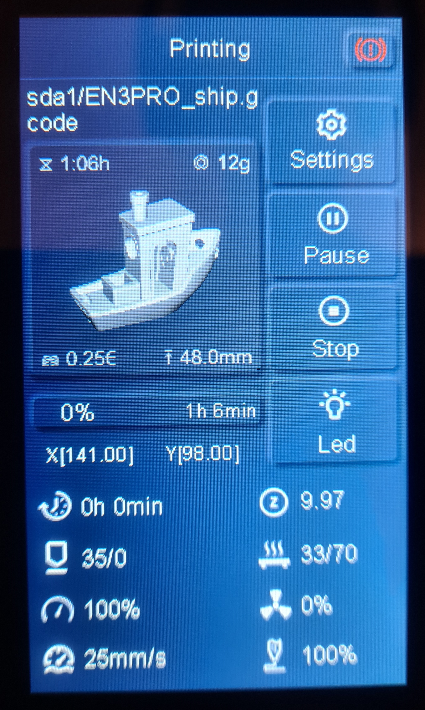
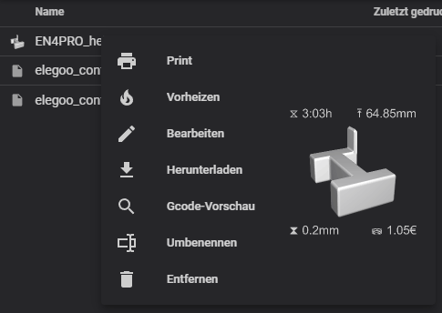
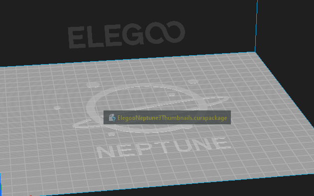
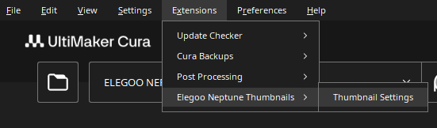
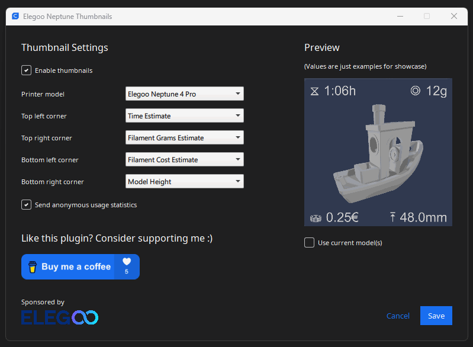

# Elegoo Neptune Thumbnails Plugin For Cura

Sponsored by \

## Support This Project

If you like this plugin, consider supporting me :)

## General Info

Cura 5.X plugin for adding gcode thumbnail images for Elegoo Neptune printers. The following models are supported (for
other models, see [FAQ](#faq)):

- Elegoo Neptune 4
- Elegoo Neptune 4 Pro
- Elegoo Neptune 3 Pro
- Elegoo Neptune 3 Plus
- Elegoo Neptune 3 Max
- Elegoo Neptune 2
- Elegoo Neptune 2S
- Elegoo Neptune 2D
- Elegoo Neptune X

Additional features:

- Display more information about the sliced model on the thumbnail
- Use a graphical user interface for thumbnail configuration
- Thumbnail preview in graphical user interface
- Add thumbnails for Klipper (to display in the Neptune 4 (Pro) web interface)

> **Note:** If you have some idea on how to improve the plugin or found a bug, feel free to create
> a [GitHub issue](https://github.com/Molodos/ElegooNeptuneThumbnails/issues/new/choose) for that

   
   

## Installation

### From GitHub (better option)

> **Note:** You need to use the `ElegooNeptuneThumbnails.curapackage` from the latest release, that is linked below. Not
> the `base.curapackage` (that one is just for development and build purposes)

1) Download the
   plugin [here](https://github.com/Molodos/ElegooNeptuneThumbnails/releases/latest/download/ElegooNeptuneThumbnails.curapackage)
   and drag the `.curapackage` file into the Cura window (like onto the build
   plate) 
2) Restart Cura
3) Configure the plugin as shown in [Usage](#usage)
4) If it isn't working, check the [FAQ](#faq)

### From Cura Marketplace (not always the latest version)

> **Note:** As review by Ultimaker takes pretty long (almost a whole month), the plugin could be outdated when
> installing it that way. For latest releases, checkout the installation from GitHub above

1) Install the plugin
   from [Cura marketplace](https://marketplace.ultimaker.com/app/cura/plugins/molodos/ElegooNeptune3Thumbnails)
2) Restart Cura
3) Configure the plugin as shown in [Usage](#usage)
4) If it isn't working, check the [FAQ](#faq)

## Usage

> **Note:** Settings are per printer, so if you switch the printer, you have to reconfigure the settings

1) Open the thumbnail settings menu \
   
2) Configure thumbnail settings as you wish \
   

### Thumbnail Settings Overview

| Setting                           | Description                                                                                              |
|-----------------------------------|----------------------------------------------------------------------------------------------------------|
| `Enable thumbnails`               | Includes a thumbnail of the object to the gcode                                                          |
| `Printer model`                   | The printer model to generate thumbnails for (different models user different algorithms for generation) |
| `Top left corner`                 | Information display option (see below) for the top left corner                                           |
| `Top right corner`                | Information display option (see below) for the top right corner                                          |
| `Bottom left corner`              | Information display option (see below) for the bottom left corner                                        |
| `Bottom right corner`             | Information display option (see below) for the bottom right corner                                       |
| `Send anonymous usage statistics` | Enables the collection of anonymous [usage statistics](#usage-statistics)                                |
| `Use current model(s)`            | Use the current model(s) in the preview thumbnail                                                        |

### Information Display Options

| Setting                    | Description                                                                                 |
|----------------------------|---------------------------------------------------------------------------------------------|
| `Time Estimate`            | Includes the estimated print time in the thumbnail                                          |
| `Filament Grams Estimate`  | Includes the estimated filament usage in grams in the thumbnail                             |
| `Layer Height`             | Includes the layer height in the thumbnail                                                  |
| `Model Height`             | Includes the model height in the thumbnail                                                  |
| `Filament Cost Estimate`   | Includes the estimated filament cost (based on cost in filaments settings) in the thumbnail |
| `Filament Meters Estimate` | Includes the estimated filament usage in meters in the thumbnail                            |
| `Line Width`               | Includes the line width (of the firs extruder) in the thumbnail                             |

## FAQ

### Does my printer support this plugin?

If your printer is in the settings dropdown, it should be supported. If your printer does support thumbnails, but it is
not available in the dropdown, don't hesitate to open
a [GitHub issue](https://github.com/Molodos/ElegooNeptuneThumbnails/issues/new/choose) and I will see what I can do.

**Note:** The "normal" Neptune 3 doesn't support displaying thumbnails, I have talked with Elegoo as there were many
people asking for it.

### Thumbnails are not generated. What to do?

1) Make sure, that the plugin is installed correctly. Click "Marketplace" on the top right and then the settings gear on
   the top right. The plugin should be displayed under "Installed Plugins"
2) Make sure, that thumbnails are enabled in the settings and the correct printer is selected

### Why do thumbnails not change when printing another gcode file?

There seems to be a bug in older printer firmware versions which causes the thumbnail to not update if you start a print
right after the last one ended. Restarting the printer in between prints seems to fix that. If this is the case for you,
check your printer for firmware updates, which might fix the bug.

### Is there PrusaSlicer support?

Yes, but only as a lite version because PrusaSlicer does not have enough possibilities for complex plugins. Check it
out [here](https://github.com/Molodos/ElegooNeptuneThumbnails-Prusa)

## Development Guide

1) Install requirements `pip install -r requirements.txt`
2) Add `cura` folder from https://github.com/Ultimaker/Cura to base directory (needed as lib)
3) Add `UM` folder from https://github.com/Ultimaker/Uranium to base directory (needed as lib)
4) Develop
5) Create package `python -m package_plugin` (package will be
   under `package_plugin/ElegooNeptuneThumbnails.curapackage`)

> **Note:** For some reason, QPainter will not accept all pngs. Usually, re-saving pngs with paint will fix problems (at
> least for non-transparent images)

## Usage Statistics

The plugin will collect some anonymous usage statistics in order to make improvements easier. You can opt out of usage
statistics by removing the checkbox in the thumbnail settings at any time.

Usage statistics are only related to an anonymous statistics id that is generated randomly when you install the plugin.
No personal data is being collected. The statistics data, that is collected, is limited to the following:

- Name of this plugin
- Version of this plugin
- The anonymous statistics id
- The printer model from profile (e.g. "Elegoo Neptune 3 Pro")
- The printer model selected (e.g. "Elegoo Neptune 3 Pro")
- The information display options you are using (e.g. `Layer Height`)
- Version of Cura
- Operating system (e.g. `Windows 10.0.22621`)
- Enabled state of thumbnails
- Enabled state of Klipper thumbnails

> **Note:** This list might change at some time, so keep an eye on it if you update the plugin. Be aware, that personal
> data will never be added to this list.

## License

This repository uses code snippets and image encoding binaries from Elegoo Cura MKS Plugin and is therefore released
under the **AGPL v3** license.
