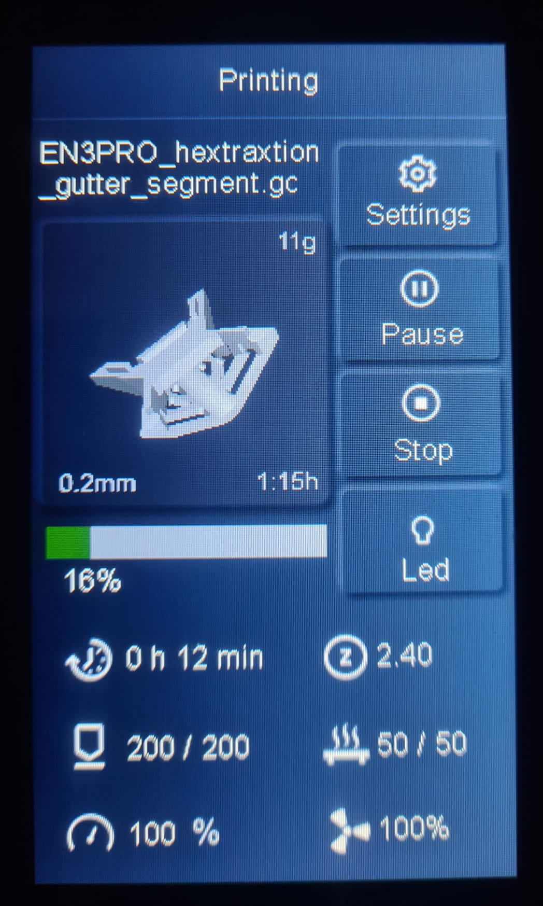

# Elegoo Neptune Thumbnails Plugin For Cura

Cura 5 plugin for adding G-code thumbnail images for Elegoo Neptune printers (tested for Elegoo Neptune 3 Pro). I have
not tested every printer, but it seems like based on feedback at least the following models are supported for other
models, see [FAQ](#faq)):

- Elegoo Neptune 3 Pro
- Elegoo Neptune 3 Plus
- Elegoo Neptune 3 Max
- Elegoo Neptune 2

Additional Features:

- The estimated print time can be added to thumbnail
- Add estimated filament usage in meters to thumbnail
- Add estimated filament usage in grams (for 1.75mm diameter PLA) to thumbnail
- Add layer height to thumbnail

> If you have some idea on how to improve the plugin, feel free to create an issue for that

## Support This Project

If you like this project, every support is welcome :D

## Installation

1) Download
   the [plugin](https://github.com/Molodos/ElegooNeptuneThumbnails/releases/latest/download/ElegooNeptuneThumbnails.curapackage)
2) Drag the `.curapackage` file into the Cura window (like onto the build plate) and restart Cura
   
3) Configure the plugin as shown in [Usage](#usage)

## Usage

### Possible Options

> **Note:** A maximum of 4 options more than `;includeThumbnail` is supported. \
> The order in which you specify your options in the start G-code will also be the display
> order (`top-left` > `top-right` > `bottom-left` > `bottom-right`)

| Option                           | Description                                                                                                                        |
|----------------------------------|------------------------------------------------------------------------------------------------------------------------------------|
| `;includeThumbnail`              | Includes a thumbnail of the object to the gcode                                                                                    |
| `;includeTimeEstimate`           | Includes the estimated print time in the thumbnail (needs `;includeThumbnail` to be active)                                        |
| `;includeFilamentMetersEstimate` | Includes the estimated filament usage in meters in the thumbnail (needs `;includeThumbnail` to be active)                          |
| `;includeFilamentGramsEstimate`  | Includes the estimated filament usage in grams (for 1.75mm diameter PLA) in the thumbnail (needs `;includeThumbnail` to be active) |
| `;includeLayerHeight`            | Includes the layer height in the thumbnail (needs `;includeThumbnail` to be active)                                                |                                                                                  |

### Adding An Option

1) Open printer selection menu and choose `Manage printers` \
   
2) Choose your Elegoo Neptune 3 Pro/Plus/Max printer and then `Machine Settings` \
   
3) At the top of `Start G-code` add your preferred options \
   

## FAQ

### Does my printer support this plugin?

I am pretty sure, that the plugin cannot break anything as it just generates an encoded image in the G-code, that a
printer will only interpret if it can. So I guess just try it out. To be sure, you should look at your printer for the
start of the print and be ready to cancel the print if it seems to behave weird.

### Thumbnails are not generated, what to do?

Make sure, that your printer was added to Cura using the official definition for your Neptune printer as a base. If you
for example used an Ender 3 definition as a base and modified it, it won't work because the plugin cannot identify the
printer model.

### Why does my Neptune 3 not display thumbnails?

For now, the Neptune 3 model is disabled as it also is disabled in the official Elegoo Cura. I have heard, that support
for thumbnails might have been added to the printer firmware, so I might be adding thumbnails for that printer in the
future.

## Development Guide

1) Install requirements `pip install -r requirements.txt`
2) Add `cura` folder from https://github.com/Ultimaker/Cura to base directory (needed as lib)
3) Add `UM` folder from https://github.com/Ultimaker/Uranium to base directory (needed as lib)
4) Develop
5) Create package `python -m package_plugin` (package will be
   under `package_plugin/ElegooNeptuneThumbnails.curapackage`)
6) Use the `text/test.py` script for testing the formatting of image texts

## Contribution

This repository is based on [sigathi/ElegooN3Thumbnail](https://github.com/sigathi/ElegooN3Thumbnail) and therefore
released under the **AGPL v3** license.
