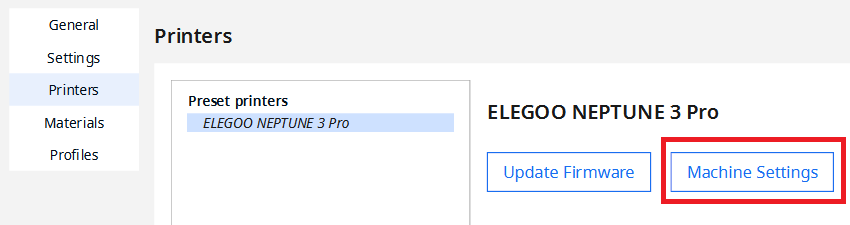
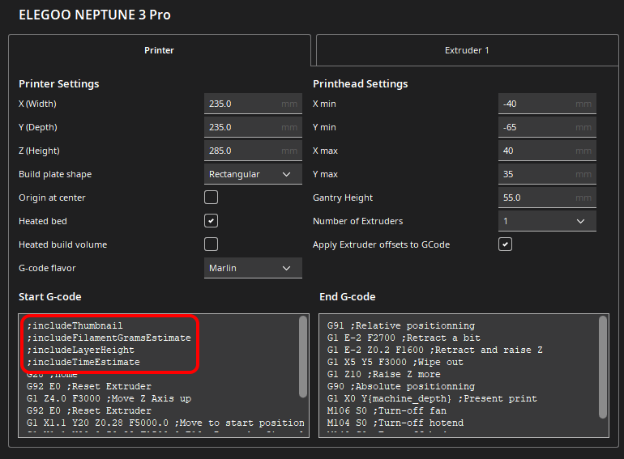

# Elegoo Neptune 3 Pro/Plus/Max Thumbnails Plugin For Cura

Cura 5 plugin for adding G-code thumbnail images Elegoo Neptune 3 Pro/Plus/Max printers (tested for Elegoo Neptune 3
Pro)

Additional Features:

- The estimated print time is added to the thumbnail for a better overview

> TODO: Add image of example thumbnail on printer

## Installation

> TODO: Add download link (and create release)

1) Download the [plugin]()
2) Drag the `.curapackage` file onto Cura and restart Cura

## Usage

### Possible Options

| Option                 | Description                                                                                 |
|------------------------|---------------------------------------------------------------------------------------------|
| `;includeThumbnail`    | Includes a thumbnail of the object to the gcode                                             |
| `;includeTimeEstimate` | Includes the estimated print time in the thumbnail (needs `;includeThumbnail` to be active) |

### Adding An Option

1) Open printer selection menu and choose `Manage printers`
   
2) Choose your Elegoo Neptune 3 Pro/Plus/Max printer and then `Machine Settings`
   
3) At the top of `Start G-code` add your preferred options
   

## Development Guide

1) Install requirements `pip install -r requirements.txt`
2) Add `cura` folder from https://github.com/Ultimaker/Cura to base directory (needed as lib)
3) Add `UM` folder from https://github.com/Ultimaker/Uranium to base directory (needed as lib)
4) Start developing

## Contribution

This repository is based on [sigathi/ElegooN3Thumbnail](https://github.com/sigathi/ElegooN3Thumbnail).
